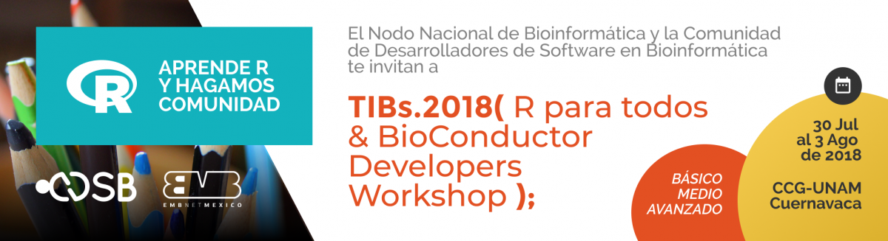

# Latin American R/BioConductor Developers Workshop 2018

_July 30 - August 3, 2018. Cuernavaca_

Welcome to the repository for the 2018 R/Bioconductor developers workshop. CDSB will be hosting its first workshop focused on R developers in Cuernavaca, Morelos, Mexico.

* Please post ideas for projects, ways to grow the CDSB community and feedback as [issues](https://github.com/ComunidadBioInfo/rbioc18/issues/).

## Materials

The materials are organized by instructor in order of first appearance. For the full schedule, check [the main website](http://www.comunidadbioinfo.org/r-bioconductor-developers-workshop-2018/).

* [Alejandro Reyes](http://alejandroreyes.org/)
    - Welcome: [slides](https://www.dropbox.com/s/wb9ng2slpbnteab/CDSB-AlejandroReyes_v1.1.pdf?dl=0).
* [Leonardo Collado-Torres](http://lcolladotor.github.io):
    - Keynote I: [slides](https://speakerdeck.com/lcolladotor/cdsbmexico).
* [Daniel Piñero](http://web.ecologia.unam.mx/index.php/investigadores/daniel-pinero)
    - In replacement of Alicia Mastretta Yanes. Talk TBD.
* [Alejandra Medina-Rivera, Alejandro Reyes](http://liigh.unam.mx/amedina/)
    - Programming with R - functions [git repo](https://github.com/amedina-liigh/QuickIntroToR).
    - Creating a package [git repo](https://github.com/ComunidadBioInfo/rbioc18/tree/master/materials/package_intro) [package](https://github.com/areyesq89/DESeq2MDS)
* [Selene Fernandez-Valverde](https://www.linkedin.com/in/selenefernandez/)
    - Version control with git and GitHub: [git repo](https://liz-fernandez.github.io/TIB2018_Git/)
    - Open source software projects and collaborative development: [git repo](https://liz-fernandez.github.io/TIB2018_Git/)
* [Martin Morgan](https://www.roswellpark.org/martin-morgan)
    - Keynote Lecture II: [slides](), [R file](), [slides raw]().
    - Best practices for writing efficient functions: [slides](), [R file](), [slides raw]().
    - S4 - system for object oriented programming: [slides](), [R file](), [slides raw]().
    - Unit testing and R CMD check: [slides](), [R file](), [slides raw]().
    - Debugging and Parallelization: [slides](), [R file](), [slides raw]().
* [Alejandro Ponce-Mendoza](https://github.com/APonce73)
    - Using R-Shiny in Agrobiodiversity: [slides](), [R file](), [slides raw]().
* [Benilton Carvalho](https://scholar.google.com/citations?user=44vQTS4AAAAJ&hl=en)
    - Bioconductor: core package, common objects and extending classes: [slides](), [R file](), [slides raw]().
    - Vignette writing with markdown/BiocStyle: [slides](), [R file](), [slides raw]().
    - Rcpp (Adding C/C++ code to R packages): [slides](), [R file](), [slides raw]().
    - Keynote Lecture IV: [slides](), [R file](), [slides raw]().
* [Teresa Ortíz](http://www.teresa-ortiz.com/eng)
    - RLadies Community Experience: [slides](), [R file](), [slides raw]().

## Installation instructions

1. Install R 3.5 through [CRAN](https://cran.r-project.org/)
2. Install the latest stable [Rstudio Desktop](https://www.rstudio.com/products/rstudio/download/)
3. Install the latest stable [git](http://happygitwithr.com/install-git.html)
4. Connect [Rstudio with git](http://happygitwithr.com/rstudio-git-github.html)
5. Install the following R packages: `devtools`, `roxygen2`, `Rcpp`, `RcppArmadillo`, `knitr` using the `install.packages()` function. You can also check https://www.bioconductor.org/install/ for more information.

## Code of conduct

To ensure a safe, enjoyable, and friendly experience for everyone who participates, we have a [code of conduct](https://github.com/ComunidadBioInfo/R-BioConductor-Developers-Workshop-2018/blob/master/R-Bioconductor-2018_Program.rmd#code-of-conduct).  This applies to people attending in person or remotely, and for interacting over the [issues](https://github.com/ComunidadBioInfo/rbioc18/issues/).

## Support

This meeting is made possible by generous support from:

- SoIBio
- CCG-UNAM
- LCG-UNAM
- LIIGH-UNAM
- RConsortium

This README was based on the [rOpenSci unconf18 README](https://raw.githubusercontent.com/ropensci/unconf18/master/README.md).
